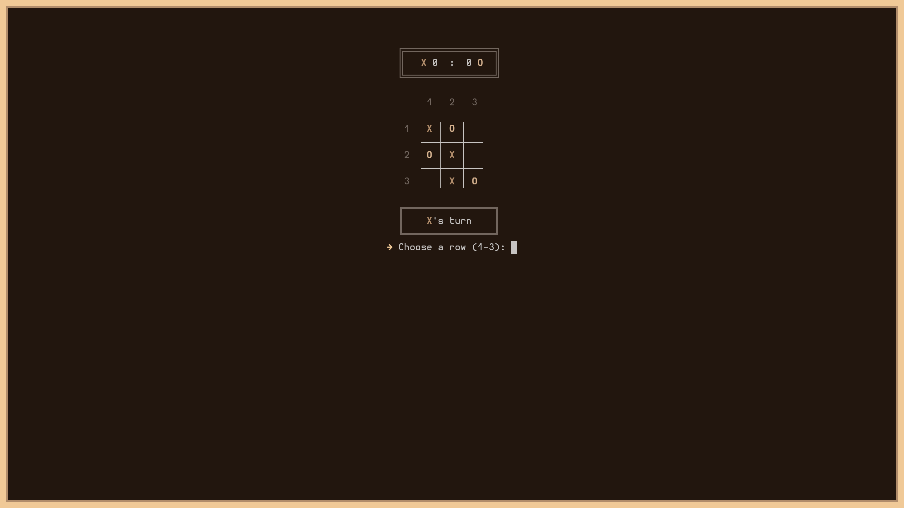

# Tic Tac Toe TUI

A minimalist, and colored version of Tic Tac Toe, written in C.

<p align="center">
  
</p>

## How to Run

Ensure you have `gcc` and `make` installed.

1. Build the project:
   ```bash
   make
   ```

2. Run the game:
   ```bash
   ./tictactoe
   ```

3. Clean temporary files:
   ```bash
   make clean
   ```

## Dependencies
- Compiler: GCC (or any C99 compatible compiler).
- Build System: GNU Make.
- Terminal: Support for ANSI escape sequences (colors) and Unicode characters (UTF-8).
